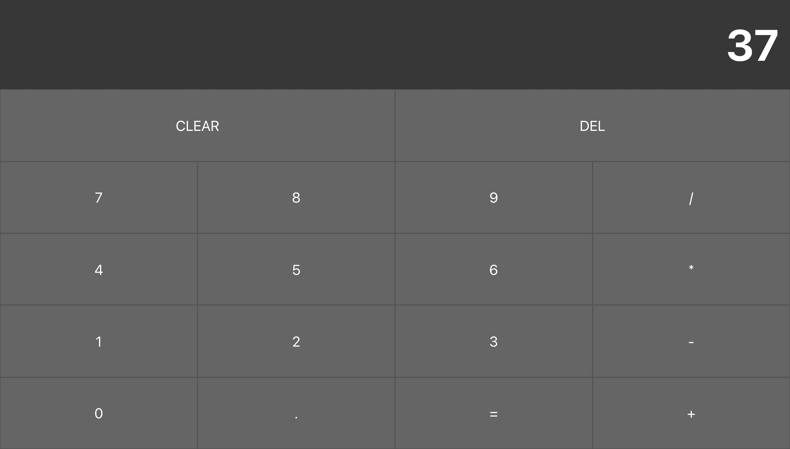

# Calculator

### To start:

Application based on expo. So, you can start it
in web, iOS or Android.

#### Install dependencies

`yarn install`

#### Start expo server

`expo start`

#### How it should look like

Support complex expressions

